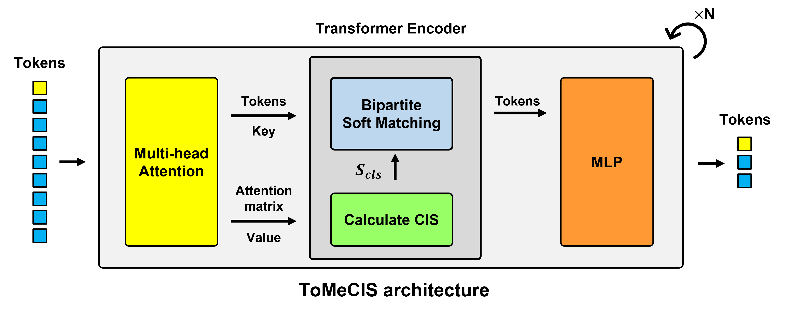
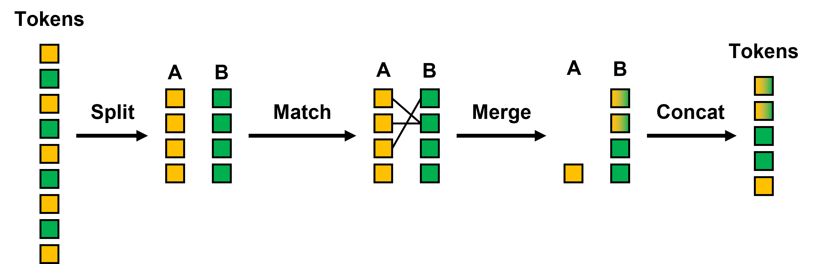

#  Token Merging with Class Importance Score

Pytorch Implementation of ToMeCIS from [our paper](http://166.104.144.154/publications/2023/sks_Token_Merging_with_Class_Importance_Score%20final_ver.pdf) in IECON 2023
*   Kwangsoo Seol, Sidong Roh, Kiseok Chung

## Visualization


## Introduction
ToMeCIS is token reduction method for Vision Transformer Architectures. It merges similar tokens to accelerate ViTs. It merges similar tokens with class importance score of tokens. We use Bipartite Soft Matching in [ToMe](https://github.com/facebookresearch/ToMe)


## Architecture of ToMeCIS



## Bipartite Soft Matching



## Class importance score calculation


- **_A_**: Attention matrix
- **_V_**: Value matrix
- **_A<sub>cls_**: First row of attention matrix
- **_S<sub>cls_**: Class attention score 


## Experimental results
We experimented on ImageNet-1k using one GeForce RTX 3090. We used pretrained timm model. No additional training was performed after applying ToMeCIS. We used a batch size of 128 for all experiments.
- r: Reduced number of tokens in every ToMeCIS block.

### Experiment on DeiT-Ti model.
| r  | acc <br> (%)  | throughput <br> (img/s) |
|:--:|:-------:|:----------:|
| baseline | 72.132 | 3342.88 |
| 8  | 71.614 | 3795.99 |
| 9  | 71.356 | 3944.83 |
| 10 | 71.28  | 4107.27 |
| 11 | 71.012 | 4272.49 |
| 12 | 70.934 | 4461.66 |
| 13 | 70.594 | 4672.44 |
| 14 | 70.148 | 4891.94 |
| 15 | 69.642 | 5134.47 |
| 16 | 69.012 | 5367.96 |

### Experiment on DeiT-S model
| r  | acc <br> (%)  | throughput <br> (img/s) |
|:--:|:-------:|:----------:|
| baseline | 79.82 | 1283.4 |
| 8  |  79.43 | 1553.46 |
| 9  | 79.374 | 1609.55 |
| 10 | 79.228 | 1684.36 |
| 11 | 79.232 | 1759 |
| 12 | 79.022 | 1841.78 |
| 13 | 78.902 | 1949.6 |
| 14 | 78.696 | 2027.89 |
| 15 | 78.522 | 2137.17 |
| 16 | 78.174 | 2245.69 |

### Performance comparison with other token reduction methods 

We compared other token reduction methods. These methods are applied to pretrained DeiT-S model. No additional training was performed after applying token reduction methods.
We set the reduction rate to have a similar throughput.

| Method | acc <br> (%) | throughput <br> (img/s) |
|:------|:---:|:----------:|
| DeiT-S         | 79.82          | 1282.5        |
| DeiT-S-EViT    | 78.52 (-1.3)  | 1872.3 (+46%) |
| DeiT-S-ToMe    | 78.79 (-1.03) | 1956.1 (+52.5%) |
| DeiT-S-ToMeCIS | 78.90 (-0.92) | 1949.6 (+52%) |


## Usage

#### Evaluation
```
python main.py --model_name deit_small_patch16_224 --batch_size 128 --input_size 224 --reduce_num 13 \
--data_path /path/to/imagenet --pt_dl /path/to/download/pretrained/model \
--eval --use_amp False --dist_eval False
```

#### Visualization
```
python visualization.py --model_name deit_small_patch16_224 --reduce_num 13 \
--img_pth /path/to/image/for/visualization --pt_dl /path/to/download/pretrained/model
```

## Citation
If you use this repo in your work, please cite:
```
@inproceedings{tomecis,
  title={Token Merging with Class Importance Score},
  author={Kwangsoo Seol, Sidong Roh and Kiseok Chung},
  booktitle={The 49th Annual Conference of the IEEE Industrial Electronics Society},
  year={2023}
}
```

## Acknowledgements
Our code is based on:
1. [ToMe](https://github.com/facebookresearch/ToMe) for bipartite soft matching
2. [ATS](https://github.com/adaptivetokensampling/ATS) for score calculation
