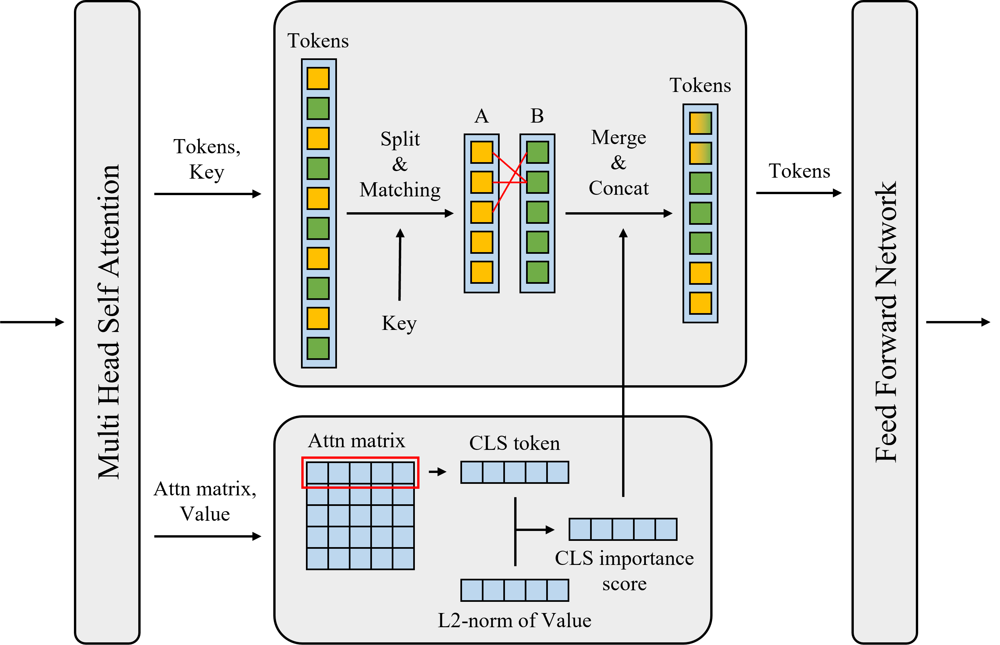

#  Token Merging with Class Importance Score

Pytorch Implementation of ToMeCIS from our paper in IECON 2023 (Not published yet)
*   Kwangsoo Seol, Sidong Roh, Kiseok Chung

## Introduction
ToMeCIS is token reduction method for Vision Transformer Architectures. It merges similar tokens to accelerate ViTs. It merges similar tokens using Bipartite Soft Matching with class importance score of tokens. We'll upload the link to the paper later.



## Experimental results
We experimented on ImageNet-1k using one GeForce RTX 3090. We used pretrained timm model without further training.  Batch size was 128. Parameter r is the reduced number of tokens in every ToMeCIS block.

### Experiment on DeiT-Ti model.
| r  | acc  | img/s |
|:--:|-------:|----------:|
| 0 (baseline)  | 72.132 | 3342.88 |
| 8  | 71.614 | 3795.99 |
| 9  | 71.356 | 3944.83 |
| 10 | 71.28 | 4107.27 |
| 11 | 71.012 | 4272.49 |
| 12 | 70.934 | 4461.66 |
| 13 | 70.594 | 4672.44 |
| 14 | 70.148 | 4891.94 |
| 15 | 69.642 | 5134.47 |
| 16 | 69.012 | 5367.96 |


### Experiment on DeiT-S model
| r  | acc  | img/s |
|:--:|-------:|----------:|
| 0 (baseline)  | 79.82 | 1283.4 |
| 8  |  79.43 | 1553.46 |
| 9  | 79.374 | 1609.55 |
| 10 | 79.228 | 1684.36 |
| 11 | 79.232 | 1759 |
| 12 | 79.022 | 1841.78 |
| 13 | 78.902 | 1949.6 |
| 14 | 78.696 | 2027.89 |
| 15 | 78.522 | 2137.17 |
| 16 | 78.174 | 2245.69 |

## Evaluation usage
```
python main.py --model_name ${model_name} --batch_size 128 --input_size 224 --data_path /path/to/imagenet --pt_dl /path/to/download/pretrained/model --reduce_num 13 --eval --use_amp True --dist_eval False
```

## Citation
If you use this repo in your work, please cite:
```
@inproceedings{tomecis,
  title={Token Merging with Class Importance Score},
  author={Seol, Roh and Chung},
  booktitle={The 49th Annual Conference of the IEEE Industrial Electronics Society},
  year={2023}
}
```

## Acknowledgements
Our code is based on [ToMe](https://github.com/facebookresearch/ToMe).
